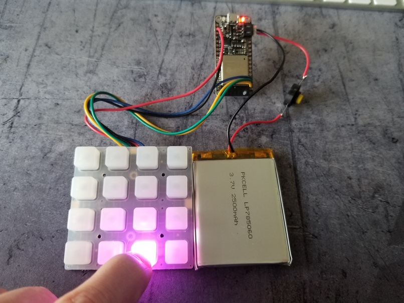
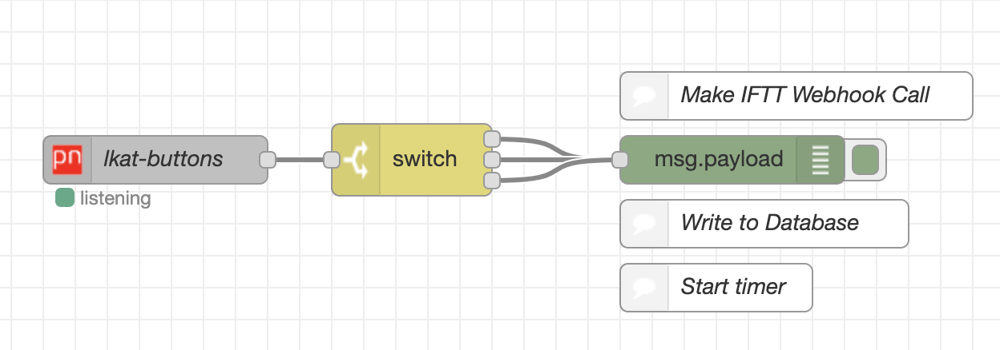

# LKAT Launchpad

What is this?
---
> A configurable IoT launchpad

Getting Started
---
Rename `src/secrets.example.h` to `src/secrets.h`

Fill in the values for your wifi and PubNub keys

Build and copy to your device

The below Node Red example can be ran to see your values come through

Change the PubNub keys in Node Red also.

Node Red Sample Config

[
    {
        "id": "aa626afa.d18a48",
        "type": "tab",
        "label": "Launchpad Example",
        "disabled": false,
        "info": ""
    },
    {
        "id": "667dd209.e0816c",
        "type": "pubnub in",
        "z": "aa626afa.d18a48",
        "keys": "21f7b58f.95169a",
        "channel": "lkat-buttons",
        "auth_token": "",
        "cipher_key": "",
        "ssl": true,
        "verbose_logging": false,
        "x": 270,
        "y": 200,
        "wires": [
            [
                "f8c9fde3.d3dc1"
            ]
        ]
    },
    {
        "id": "f8c9fde3.d3dc1",
        "type": "switch",
        "z": "aa626afa.d18a48",
        "name": "",
        "property": "payload",
        "propertyType": "msg",
        "rules": [
            {
                "t": "eq",
                "v": "1",
                "vt": "str"
            },
            {
                "t": "eq",
                "v": "2",
                "vt": "str"
            },
            {
                "t": "else"
            }
        ],
        "checkall": "true",
        "repair": false,
        "outputs": 3,
        "x": 430,
        "y": 200,
        "wires": [
            [
                "e2c4f602.f43738"
            ],
            [
                "e2c4f602.f43738"
            ],
            [
                "e2c4f602.f43738"
            ]
        ]
    },
    {
        "id": "e2c4f602.f43738",
        "type": "debug",
        "z": "aa626afa.d18a48",
        "name": "",
        "active": true,
        "tosidebar": true,
        "console": false,
        "tostatus": false,
        "complete": "false",
        "x": 630,
        "y": 200,
        "wires": []
    },
    {
        "id": "4eb98516.7ceebc",
        "type": "comment",
        "z": "aa626afa.d18a48",
        "name": "Make IFTT Webhook Call",
        "info": "",
        "x": 670,
        "y": 160,
        "wires": []
    },
    {
        "id": "c5883b3f.f751c8",
        "type": "comment",
        "z": "aa626afa.d18a48",
        "name": "Write to Database",
        "info": "",
        "x": 650,
        "y": 240,
        "wires": []
    },
    {
        "id": "b14f25c6.5c1c88",
        "type": "comment",
        "z": "aa626afa.d18a48",
        "name": "Start timer",
        "info": "",
        "x": 620,
        "y": 280,
        "wires": []
    },
    {
        "id": "21f7b58f.95169a",
        "type": "pubnub-keys",
        "z": "",
        "pub_key": "demo",
        "sub_key": "demo"
    }
]

Who is it meant or not meant for?
---
**For** - DIY makers / software devs

**Not For** - Production NASA space shuttle dashboards that can withstand and communicate travelling and operating in the harsh conditions of space

Why?
---
I like automation. Sometimes I don't want to go to my web dashboards or forms, or open a phone, find the app, hit a button or create a record manually

This is a quick easy way to invoke things to happen or record events that don't need any input, like "Fed dog at 8 am" just by pressing a button. Or "start timer for 15 minutes"

Dependencies
---
* PubNub
* WiFi Network Connectivity
* Node Red

Costs
---
(This could be way cheaper)

| Name  | Price  | Link  |
|---|---|---|
| Huzzah Feather ESP32  | $19.95  | https://www.adafruit.com/product/3405 |
| Neotrellis PCB  | $12.50  | https://www.adafruit.com/product/3954 |
| Silicone Keypads  | $4.95  | https://www.adafruit.com/product/1611 |
| 2500mAh Battery  | $14.95  | https://www.adafruit.com/product/328  |

**Total**: $52.35

Button Ideas
---
* Fed dog
* Timers

Pros
---
* Pretty colors
* Easy to get started
* Not much infrastructure required using free cloud services

Cons
---
* Cost
* Only works with network & internet connectivity

Hardware Features
---
* On/Off switch
* Animation let's you know everything is ready to go
* LED let's you know the device is powered on

Improvements
---
* Play mode
* Fairly accurate estimation of battery expectancy
* Publish battery voltage (possible low battery warning)
* Really nice enclosure: https://www.adafruit.com/product/4339 or 3D print or make one from wood

Issues
---
This didn't work even though ESP32 was there using the PubSubClient
https://www.pubnub.com/blog/pubsub-nodemcu-32s-esp32-mqtt-pubnub-arduino-sdk/

Resources
---
https://learn.adafruit.com/adafruit-neotrellis/arduino-code
https://docs.platformio.org/en/latest/projectconf/section_env_upload.html#upload-speed
